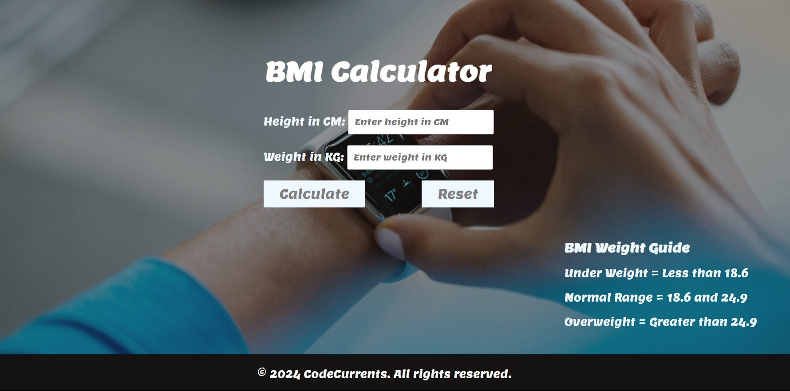

# Projects related to DOM

## Projects Link:

[Click Here to get all the Projects we've made.](https://stackblitz.com/edit/dom-project-chaiaurcode?file=index.html)

# Solution Code

## Project - 2 (HTML)

```HTML
<!DOCTYPE html>
<html lang="en">
  <head>
    <meta charset="UTF-8" />
    <meta name="viewport" content="width=device-width, initial-scale=1.0" />
    <meta http-equiv="X-UA-Compatible" content="ie=edge" />
    <!-- <link rel="stylesheet" href="style.css" /> -->
    <link rel="stylesheet" href="./styles.css" />
    <link rel="shortcut icon" href="TimeToRun.jpg" type="image/x-icon" />
    <title>BMI Calculator</title>
  </head>
  <body>
    <div class="landing-page">
      <div class="overlay-1">
        <h1 class="hover-underline-animation">Welcome to CodeCurrents</h1>
      </div>
      <!-- <h3>
        "Discover Your Health Journey: Calculate BMI for a Healthier You!"
      </h3> -->
    </div>
    <div class="container">
      <div class="form-stuffs">
        <h2 class="hover-underline-animation">BMI Calculator</h2>
        <form class="form-inputs">
          <p>
            <label>Height in CM: </label
            ><input type="text" id="height" placeholder="Enter height in CM" />
          </p>
          <p>
            <label>Weight in KG: </label
            ><input type="text" id="weight" placeholder="Enter weight in KG" />
          </p>
          <div class="buttons">
            <button id="calc">Calculate</button>
            <button type="button" id="resetButton">Reset</button>
          </div>
          <div id="results"></div>
          <div id="weight-guide">
            <h3>BMI Weight Guide</h3>
            <p>Under Weight = Less than 18.6</p>
            <p>Normal Range = 18.6 and 24.9</p>
            <p>Overweight = Greater than 24.9</p>
          </div>
        </form>
      </div>
    </div>
    <footer class="site-footer">
      <p>&copy; 2024 CodeCurrents. All rights reserved.</p>
    </footer>
  </body>
  <script src="script.js"></script>
</html>

```

## Project - 2 (CSS)

```CSS
@import url("https://fonts.googleapis.com/css2?family=Roboto:wght@100;300;400;500;700;900&display=swap");
@import url("https://fonts.googleapis.com/css2?family=Lemon&display=swap");

* {
  margin: 0;
  padding: 0;
  box-sizing: border-box;
  font-family: "Lemon", sans-serif;
  overflow-x: hidden;
}
body {
  background-color: #212121;
  color: aliceblue;
  max-width: 1280px;
}
.landing-page {
  width: 100vw;
  height: 100vh;
  background-image: url(./HomeImg.jpg);
  background-size: contain;
  background-position: center;
}

.overlay-1 {
  width: 100%;
  height: 100%;
  background-color: #21212186;
  display: flex;
  /* flex-direction: column; */
  justify-content: center;
  align-items: center;
  flex-wrap: wrap;
}
.overlay-1 h1 {
  font-size: 3rem;
  color: #fff;
  /* font-weight: 700; */
  text-transform: uppercase;
  letter-spacing: 0.3rem;
}

.hover-underline-animation {
  display: inline-block;
  position: relative;
  color: #fff;
  text-align: center;
}

.hover-underline-animation::after {
  content: "";
  position: absolute;
  width: 100%;
  transform: scaleX(0);
  height: 0.25rem;
  bottom: 0;
  left: 0;
  background-color: #fff;
  transform-origin: bottom right;
  transition: transform 0.25s ease-out;
}

.hover-underline-animation:hover::after {
  transform: scaleX(1);
  transform-origin: bottom left;
}

/* Container Styling */

.container {
  background-image: url(./TimeToRun.jpg);
  width: 100%;
  height: 110vh;
  background-size: cover;
}

.form-stuffs {
  background-color: #1d161675;
  width: 100%;
  height: 100%;
  display: flex;
  flex-direction: column;
  justify-content: center;
  align-items: center;
  /* margin-bottom: 0.7rem; */
}

.form-stuffs h2 {
  font-size: 2.5rem;
  margin-bottom: 1rem;
}
.form-inputs p {
  margin-top: 1rem;
}

.buttons{
    display: flex;
    flex-direction: row;
    justify-content: space-between;
}

#height {
  padding: 0.5rem;
  /* color: #292222; */
}
#weight {
  padding: 0.5rem;
}
#calc {
  padding: 0.5rem 1.5rem;
  font-size: 1.2rem;
  color: grey;
  background-color: aliceblue;
  appearance: none; /* Removes default styles in Firefox */
  -webkit-appearance: none; /* Removes default styles in Chrome and Safari */
  -moz-appearance: none; /* Removes default styles in Firefox */
  outline: none; /* Removes the default focus outline */
  border: none; /* Removes default border */
  margin: 1rem 0;
}

#calc:hover {
  cursor: pointer;
}

#resetButton {
  padding: 0.5rem 1.5rem;
  font-size: 1.2rem;
  color: grey;
  background-color: aliceblue;
  appearance: none;
  -webkit-appearance: none;
  -moz-appearance: none;
  outline: none;
  border: none;
  margin: 1rem 0;
}

#resetButton:hover {
  cursor: pointer;
}

#weight-guide {
  margin-top: 2rem;
  position: absolute;
  right: 5%;
}

/* Footer */

.site-footer {
    height: 10vh;
    width: 100vw;
    background-color: #151212;
    color: #fff; /* You can choose a text color for the footer */
    text-align: center;
    display: flex;
    align-items: center;
    justify-content: center;
  }

  .site-footer p {
    margin: 0;
  }
```

## Project - 2 (javascript)

```javascript
const form = document.querySelector("form");
const resetButton = document.querySelector("#resetButton");

form.addEventListener("submit", function (event) {
  event.preventDefault();
  const height = parseInt(document.querySelector("#height").value);
  const weight = parseInt(document.querySelector("#weight").value);
  const results = document.querySelector("#results");
  if (height === "" || height < 0 || isNaN(height)) {
    results.innerHTML = "Please Enter a valid height!";
  } else if (weight === "" || weight < 0 || isNaN(weight)) {
    results.innerHTML = "Please Enter a valid weight!";
  } else {
    const bmi = (weight / ((height * height) / 10000)).toFixed(2);
    //lets make a result
    results.innerHTML = `Your BMI is: <span> ${bmi} </span>`;
  }
});
resetButton.addEventListener("click", function () {
  form.reset();
  results.innerHTML = "";
});
```
# Outcome:

